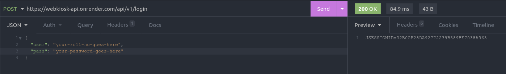
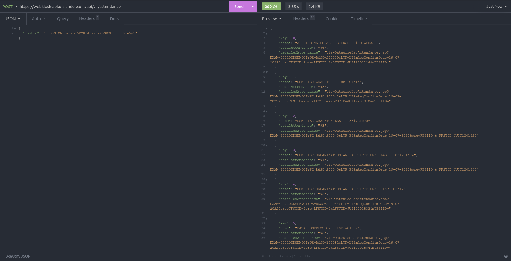
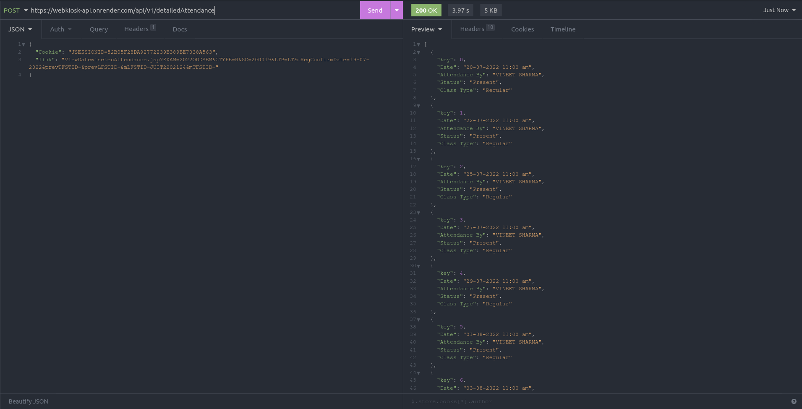

# JUIT Webkiosk API

1. Start the server by running `node server.js`

2. POST username and password as body (json) to `<server it is hosted on>/api/v1/login`. This will send you a cookie which you can use to fetch attendance and marks.

3. POST received cookie as body (json) to `<server it is hosted on>/api/v1/attendance` and `<server it is hosted on>/api/v1/marks` to get respective data.

4. Attendance route will send an additional `detailedAttendance` key which can be sent in body (json) along with cookie having `link` as its key to `<server it is hosted on>/api/v1/detailedAttendance`, this will fetch you the detailed attendance of a particular subject.

